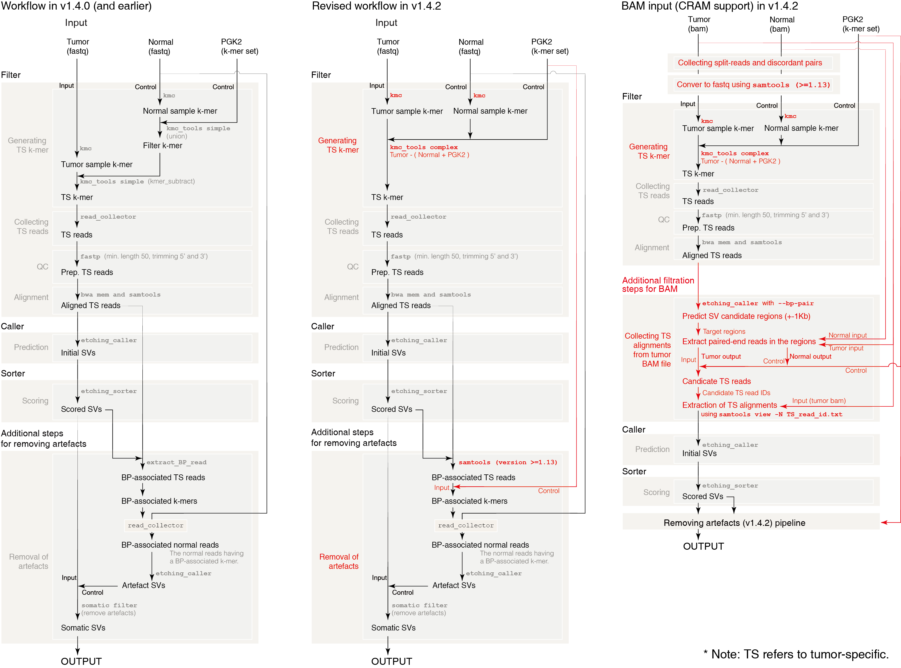

# ETCHING

### Version 1.4.2

### Ultrafast prediction of somatic structural variations by filtering out reads matched to pan-genome k-mer sets

**E**fficient de**T**ection of **CH**romosomal rearrangements and fus**I**o**N** **G**enes

ETCHING takes about 3 hours for WGS data with 30X normal and 50X tumor on 30 threads on DELL 930 server.
You can also find codes, k-mer set, and DEMO files on our website.

http://big.hanyang.ac.kr/ETCHING/download.html

We recommend using the new version of the pan-genome k-mer set, PGK2. You can download it from our website.

Using PGK2, ETCHING can detect somatic SVs from tumor sequencing data without matched-normal in comparable performance with other cutting-edge SV detection tools.


## Recent changes

#### v1.4.2

* Requirement changed
  * g++ >=7 (>=7.3 recommended)
  * cmake >=3.14
  * samtools >=1.13 (using htslib >=1.13)
* BAM mode accelerated
* CRAM support
* Minor bugs fixed

*See CHANGE.md for older updates.*


# Revised workflow in v1.4.2

ETCHING was a bit slow in removing remaining germline SVs after scoring SVs. We solved this issue by increasing Samtools requirement to >=1.13 for collecting the paired-end reads relevant to the remaining artifacts. As we updated the step, we accelerated the workflow for BAM input along with CRAM support.




# Requirements

### System

* 64-bit LINUX with >=32GB RAM (at least >=16GB).
* Tested on Fedora workstation, Centos, and Ubuntu

### Software


* Required to compile
  * gcc, g++ (>=7), make, cmake (>=3.14), wget

    *Note: g++ >=7.3 recommended*
  
* Required to run
  * BWA, samtools (>=1.13) using htslib (>=1.13)


# Guide to ETCHING

We prepared a simple guide for CentOS/Fedora or Ubuntu/Debian/Mint users. You can skip this step if all requirements were installed.

*Note: We tested this guide on Fedora32/33/34, CentOS7/8, Ubuntu16.04/18.04/20.04/22.04, Mint19/20, Debian11, and MX Linux.*


## 1. Requirements

- #### CentOS/Fedora (or other Red Hat-based Linux distros)

```bash
# Required programs 
sudo yum install -y gcc gcc-c++ make cmake bwa samtools wget
```

- #### Ubuntu/Debian/Mint (or other Debian-based distros)

```bash
## Required programs 
sudo apt install -y gcc g++ make cmake bwa samtools wget
```

## 2. Installation

Once the requirements were solved, you can install ETCHING as follows.

```bash
# Download ETCHING
git clone --depth=1 https://github.com/ETCHING-team/ETCHING.git

# Move to /path/to/ETCHING
cd ETCHING

# Installation (g++ >=7 and cmake >=3.14 required)
# g++ >=7.3 recommended
make

# Set your environment for ETCHING
echo "export PATH=/path/to/ETCHING/bin" >> ~/.bashrc
exec $SHELL
```


## 3. DEMO

```bash
# Change directory
cd /wherever/you/want/

# Download and decompress DEMO
wget http://big.hanyang.ac.kr/ETCHING/tiny_demo.tar.gz
# or you can find a demo file from our website
# http://big.hanyang.ac.kr/ETCHING/

# Decompress
tar zxvf tiny_demo.tar.gz
cd tiny_demo

# Run demo
etching -1 tumor_1.fq -2 tumor_2.fq -1c normal_1.fq -2c normal_2.fq -g Chr22.fa -f demo_PGK
```

You can run with bam or cram.
```bash
# or
etching -b tumor.sort.cram -bc normal.sort.cram -g Chr22.fa -f demo_PGK -d cram_mode -w cram_mode_work_dir -p cram_mode_output
```


# Pan-Genome k-mer set

The Pan-Genome k-mer(PGK) set is used to build PGK filter. Since we updated the PGK to PGK2, you can also download the PGK2 as below. 
If you have no matched-normal data, you are highly recommended to use the PGK2 instead of PGK to call somatic SVs. 

```bash
# Move to etching directory
mkdir -p /path/to
cd /path/to

# Download
wget http://big.hanyang.ac.kr/ETCHING/PGK2.tar.gz

# or you can download it from Amazon S3
# wget https://biglabhyu.s3.amazonaws.com/ETCHING/PGK.tar.gz

# Decompress
tar zxvf PGK2.tar.gz
cd PGK2

# Then, you must see PGK2.kmc_pre and PGK2_kmc_suf 
ls /path/to/PGK2/*
/path/to/PGK2/PGK2.kmc_pre
/path/to/PGK2/PGK2.kmc_suf
```

To use PGK2 (recommended), add ```-f /path/to/PGK2/PGK2``` option.
For instance,
```bash
etching -1 tumor_1.fq -2 tumor_2.fq -g reference.fa -f /path/to/PGK2/PGK2
```
Then, ```etching``` script will find ```/path/to/PGK2/PGK2.kmc_pre``` and ```/path/to/PGK2/PGK2.kmc_suf```.


Alternatively, you can make your custom k-mer set using ```make_pgk``` included in ETCHING package.

In the absence of matched-normal sample, we recommend using >=200 genomes to build your custom k-mer set excluding rare k-mers (<1% allele frequency). 
If you have 600 genomes, use ```-m 6``` option, which is the minimum frequency of k-mer to be included in your k-mer set.

```bash
make_pgk -i 600_genome.list -m 6 -o my_pgk
```
Here, ```600_genome.list``` is a file of ```FASTA``` files of genomes in the format of

```
/path/to/references/hg19.fasta
/path/to/references/GRCh38.fa
/path/to/references/NA12878.chr1.fna
/path/to/references/NA12878.chr2.fna
.
.
.
/path/to/assemblies/someones_genome.scaffold_1.fa
/path/to/assemblies/someones_genome.scaffold_2.fa
```


# ETCHING on a ship (docker)

### Requirement

docker 


### Download docker image

```bash
# Download ETCHING docker image
wget http://big.hanyang.ac.kr/ETCHING/ETCHING_v1.4.2.docker.tar

# Load the image
docker load -i ETCHING_v1.4.2.docker.tar

# Check the image
docker images
```

You can see like below (numbers can be different)

|REPOSITORY|TAG|IMAGE ID|CREATED|SIZE|
|:---|:---|:---|:---|:---|
|etching|1.4.2|967b3d7fb6f7|40 hours ago|1.5GB|


### Demo for docker user

Download demo data and run ETCHING with docker
```bash
wget http://big.hanyang.ac.kr/ETCHING/tiny_demo.tar.gz

tar zxvf tiny_demo.tar.gz

docker run -i -t --rm -v $PWD/tiny_demo/:/work/ etching:1.4.2 etching \
-1 tumor_1.fq -2 tumor_2.fq -1c normal_1.fq -2c normal_2.fq -g Chr22.fa -f demo_PGK -t 8
```
Here, ```etching:1.4.2``` is ```REPOSITORY:TAG``` of ETCHING docker image.

To use your data, replace ```$PWD/tiny_demo``` with ```/your/data/path/```. The directory also should contain k-mer set (PGK2).

Note: Keep ```/work/``` in the above command line, since it's the default working directory.


# ETCHING on Amazon Web Service

An older version of ETCHING (v1.4.0) is also available on Amazon Web Service (AMI ID: ami-07c7a7d8934784df9; Region: us-east-1 (Northern Virginia)).
```bash
# Lunch EC2 instance from ETCHING AMI
# And connect to EC2 instance
ssh -i Your_Key ubuntu@Your_Instance_Address

# Decompress
tar zxvf ~/resources/DEMO.tar.gz 

# Run demo
cd ~/resources/DEMO
bash example.sh
```


# Related programs

### Filtration tool for PacBio long-reads
https://github.com/ETCHING-team/LR_Filter


### Benchmarking tool
https://github.com/ETCHING-team/etching_bench


# Citing ETCHING
Sohn, Ji., Choi, MH., Yi, D. et al. Ultrafast prediction of somatic structural variations by filtering out reads matched to pan-genome k-mer sets. Nat. Biomed. Eng (2022). https://doi.org/10.1038/s41551-022-00980-5


# Contributors

Jang-il Sohn, Min-Hak Choi, Dohun Yi, A. Vipin Menon, and Jin-Wu Nam

Bioinformatics and Genomics Lab., Dept. of Life Science, Hanyang University, Seoul 04763, Korea


# Contact

#### Principal investigator

Jin-Wu Nam ([jwnam@hanyang.ac.kr]())


##### If he is unavailable, please email one of

Jang-il Sohn (sohnjangil@gmail.com)

Min-Hak Choi (choiminhak1004@gmail.com)

Dohun Yi (kutarballoon@gmail.com)

----------------------------------------------------------------------------------
